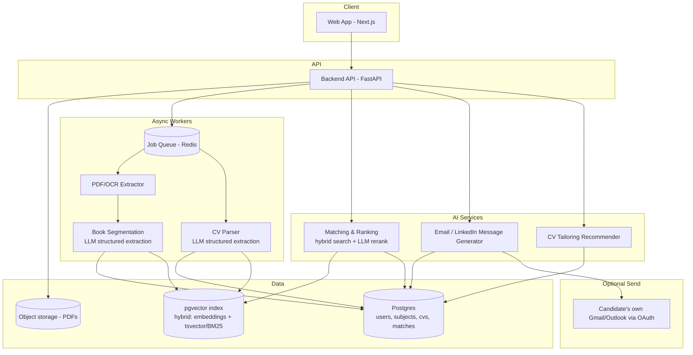

# AutoApply

## Current status

The initial Phase 0 foundation is in place:

- `apps/web`: Next.js candidate workspace shell
- `services/api`: FastAPI service with `/health`, PDF extraction, and SHA-256 book deduplication
- `services/worker`: extraction worker boundary
- `packages/shared`: structured extraction schema
- `docker-compose.yml`: Postgres with pgvector and Redis

## Run locally

```bash
npm install
npm run dev:web
```

The web app runs at `http://localhost:3000`.

To start infrastructure and the API:

```bash
docker compose up --build
```

The API health check is available at `http://localhost:8000/health`.

AutoApply is a free / open-source tool that parses PFE books (end-of-studies internship catalogs) and candidate CVs, then uses hybrid search to rank the most relevant subject and draft a tailored application.

## Problem

A PFE book is usually a PDF containing:

- company intro / mission / vision pages
- many subjects with inconsistent layouts
- title, description, required skills, location, and sometimes a contact person

Candidates typically skim the full PDF manually to find a subject that both fits their skillset and is worth targeting in a motivation email. AutoApply removes that time sink.

## Core workflow

1. Upload PFE book
2. Upload CV
3. Parse both documents into structured data
4. Rank subjects with hybrid search
5. Generate a tailored email or LinkedIn message for the best match
6. Optionally send from the candidate’s own connected mailbox
7. Optionally suggest CV improvements from a personal project bank

## Hard problems to solve first

### 1. Book segmentation

PFE books vary heavily by company, so layout-specific regexes are not enough. The MVP should use LLM-based structured extraction for the whole book, with OCR fallback for scanned PDFs.


### 2. Trust on send

Auto-sending mail can become spammy quickly. The default should be review-and-approve, and any send action should use the candidate’s own OAuth-connected mailbox.

## Architecture



## Component choices

- Backend API: Python + FastAPI
- Frontend: Next.js + Tailwind
- Database: Postgres
- Hybrid search: pgvector + tsvector/BM25 with Reciprocal Rank Fusion
- Queue: Redis + RQ or Celery
- PDF/OCR: PyMuPDF or pdfplumber, with Tesseract fallback
- Object storage: S3-compatible, with MinIO for self-hosting
- Deployment: Docker Compose for self-host, GitHub Actions for CI

## AI strategy

The system should support both self-hosted and free-tier cloud providers through a provider abstraction layer.

### Default extraction mode

- temperature 0
- structured output / JSON schema validation
- validation + retry on malformed output
- separate prompts for segmentation and field extraction

###  embedding model

- gemini-embedding-2 (or current Gemini embedding model) via Google AI Studio
- multilingual and lightweight enough for laptop use
- can provide dense and sparse signals for hybrid search

### g4f extraction

The API uses the community-maintained `g4f` client through its provider abstraction. Extraction runs through an ordered provider cascade; each tier is tried in sequence until one returns valid extraction JSON:

1. `Gemini` / `gemini-3.6-flash` (primary)
2. `Cloudflare` / `glm-5.2`
3. `Gemini` / `gemini-3.1-flash-lite`
4. `LLM7` / `default` (final fallback)

The cascade is configurable through the `G4F_PROVIDER_POOL` environment variable as a comma-separated `Provider:Model` list:

```powershell
$env:G4F_PROVIDER_POOL = "Gemini:gemini-3.6-flash,Cloudflare:glm-5.2,Gemini:gemini-3.1-flash-lite,LLM7:default"
$env:G4F_MAX_TOKENS = "8000"
$env:G4F_CHUNK_CHARACTERS = "8000"
docker compose up --build
```

Then call `POST /books/{file_hash}/extract`. Each provider in the pool is retried twice; if the whole pool fails, the endpoint returns a 500 with the per-provider errors. The application validates the returned text against the Pydantic extraction schema before saving it.


## Core data model

- User: id, email, auth fields
- PFEBook: id, file_hash, company_id, raw_pdf_ref, parsed_intro, status
- Company: id, name, mission_vision_text, values_extracted
- Subject: id, book_id, department, title, description, required_skills, location, contact
- CV: id, user_id, raw_pdf_ref, parsed_profile_json
- ProjectBankItem: id, user_id, title, description, skills, included_in_active_cv
- Match: id, cv_id, subject_id, hybrid_score, llm_rationale
- GeneratedMessage: id, match_id, type, draft_text, status
- SendLog: id, message_id, sent_at, provider, status

## Roadmap

### Phase 0: Foundations

- repo scaffolding
- Docker Compose
- CI pipeline
- auth
- provider abstraction for LLMs and embeddings
- basic admin / cost dashboard stub

### Phase 1: MVP

- PFE book upload and parsing
- file-hash deduplication
- company intro and subject extraction
- CV upload and parsing
- embeddings for subjects and CVs
- keyword index and RRF ranking
- ranked subject browser with filters
- optional rerank with short rationale

### Phase 2: Application assistance

- motivation email generation
- editable in-UI draft
- attach CV to draft
- LinkedIn message variant
- project bank CRUD
- CV tailoring recommendations

### Phase 3: Automation and trust

- Gmail / Outlook OAuth
- review-and-approve before send
- optional opt-in auto-send
- send log and follow-up reminder
- multiple books per account
- application history

### Phase 4: Open-source and scale readiness

- usage caps for hosted deployments
- self-host documentation
- local-model setup guide
- opt-in outcome tracking

## Backlog

### Phase 0

- E0.1 Repository scaffolding, Docker Compose, CI pipeline
- E0.2 Auth with email/password
- E0.3 LLM and embedding provider abstraction
- E0.4 Basic admin/cost dashboard stub

### Phase 1

- E1.1 Upload PDF, extract raw text, OCR fallback
- E1.2 File-hash dedup for already parsed books
- E1.3 LLM structured extraction for company intro / mission / values
- E1.4 LLM structured extraction for subject list
- E1.5 Human-in-the-loop review UI for extracted subjects
- E2.1 Upload CV, extract structured profile
- E2.2 Manual edit of parsed CV fields
- E3.1 Generate embeddings for subjects and CVs
- E3.2 Keyword/BM25 index over subjects
- E3.3 Combine semantic and keyword scores with RRF
- E3.4 LLM rerank top-K with rationale
- E3.5 Ranked subject browser with filters

### Phase 2

- E4.1 Motivation email generator
- E4.2 Editable draft in UI
- E4.3 Attach CV to draft
- E4.4 LinkedIn message variant
- E5.1 Project bank CRUD
- E5.2 Compare project bank and CV against required skills
- E5.3 Non-destructive swap suggestions with rationale
- E5.4 One-click apply suggestion to generate CV draft

### Phase 3

- E6.1 Gmail / Outlook OAuth
- E6.2 Review-and-approve before send
- E6.3 Optional automatic send toggle, opt-in, rate-limited
- E6.4 Send log and follow-up reminder
- E7.1 Save multiple books and companies per account
- E7.2 Cross-book search
- E7.3 Application history

### Phase 4

- E8 Per-user usage caps for hosted deployments
- E9 Self-host documentation and local-model guide
- E10 Opt-in outcome tracking to improve ranking over time

## Open decisions

- Data handling for uploaded PFE books should be documented clearly in the README and terms: users upload for personal matching only.
- French should be the primary language target for extraction prompts, with English as secondary.
- The project should support a privacy-preserving local-only mode, even if a free-tier cloud mode is available as an optional quality upgrade.

## Next step

The cleanest next implementation step is to scaffold the actual app and service boundaries around this spec: frontend, API, worker, and shared schema packages.

The next implementation milestone is E1.1: upload a PDF, extract raw text, and add an OCR fallback behind the API and worker boundaries above. File-hash deduplication (E1.2) follows immediately after.